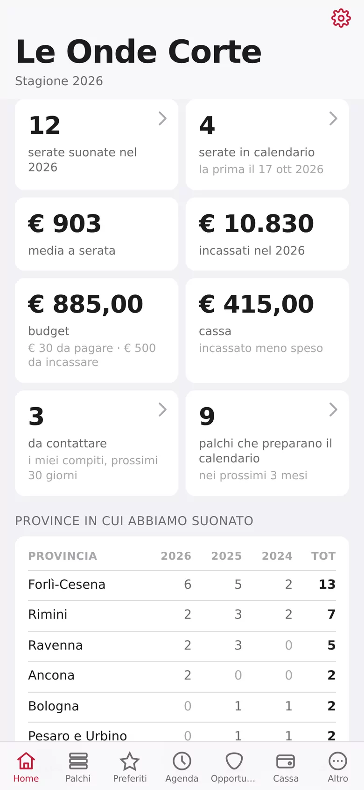
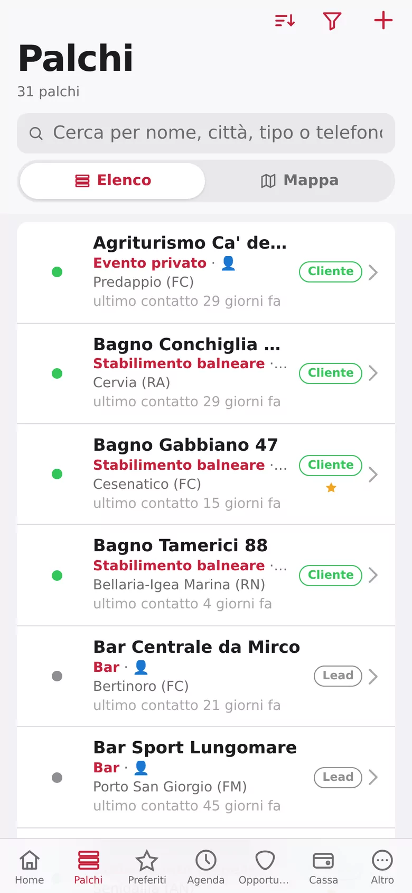
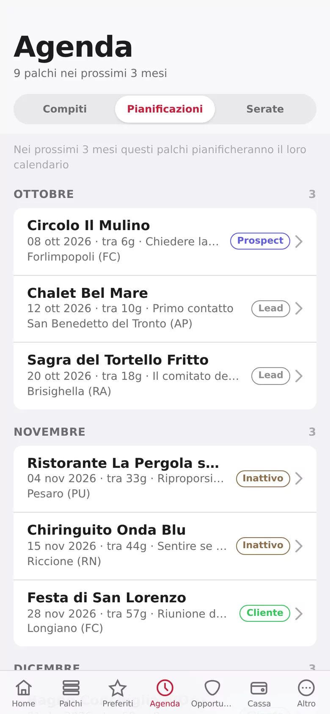
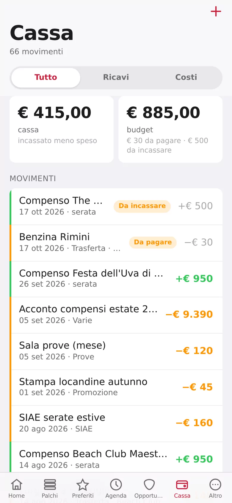

<p align="center">
  
</p>

<h1 align="center">MioPalco</h1>

<p align="center">
  <b>L'app gratuita e open source per le band che si cercano le serate da sole.</b><br>
  I locali dove suonare, chi chiamare, quando richiamare, le date chiuse e quanto avete incassato. Tutto sul telefono.
</p>

<p align="center">
  <a href="https://miopalco.com"><b>Apri l'app</b></a> ·
  <a href="https://teopost.github.io/miopalco/">Sito</a> ·
  <a href="#installarla-sul-telefono">Installarla sul telefono</a> ·
  <a href="#ospitarla-sul-tuo-server">Ospitarla da te</a> ·
  <a href="LICENSE">Licenza MIT</a>
</p>

<p align="center">
  
  
  
  
</p>

<p align="center"><sub>Le schermate mostrano dati inventati.</sub></p>

---

## Cos'è

Ogni serata comincia con una telefonata. Il bagno al mare fa il cartellone a febbraio, la festa di paese a maggio, il pub sotto casa ogni due mesi. Se sei tu a cercare le date per la band, a un certo punto il foglio Excel non basta più: non ti ricorda chi chiamare, non sa che quel locale l'anno scorso vi ha pagato 500 euro, e non lo vede il resto della band.

MioPalco è un'app per il telefono fatta per questo: segni i posti dove vuoi suonare, e lei ti dice quando è il momento di farti sentire, segue ogni trattativa fino al palco e tiene i conti delle serate.

È **gratis**, senza pubblicità e senza piani a pagamento. Su [miopalco.com](https://miopalco.com) entri con il tuo account Google e cominci. Il codice è qui, con **licenza MIT**: puoi anche farla girare sul tuo server.

## Cosa fa

| | |
|---|---|
| **Palchi** | La rubrica dei posti dove suonare: pub, stabilimenti balneari, feste di paese, circoli, ristoranti, eventi privati. Ogni palco ha stato (Lead, Prospect, Interessato, Cliente, Inattivo, Archiviato), tipo, tag, contesto, stagionalità, indirizzo e posizione sulla mappa, referente o art director, foto di copertina e lo storico dei contatti. Ricerca, filtri a spunta multipla e vista mappa. |
| **Preferiti** | Una stella personale sui palchi che vuoi tenere sott'occhio. |
| **Agenda** | I compiti (chi fa cosa e per quando, i miei o di tutti), le **programmazioni** (i palchi che preparano il calendario delle serate in questo mese e nei due dopo) e le serate in calendario. I mesi di programmazione si scelgono nel palco e valgono ogni anno: «a febbraio» torna da solo ogni stagione. |
| **Opportunità** | Ogni tentativo di serata, dal primo contatto alla data: Contattato, Trattativa, Confermato, e poi Suonato, Annullato o Rifiutata. Con data, compenso e note. La prima serata suonata trasforma il palco in Cliente da sola. |
| **Cassa** | I compensi delle serate entrano da soli. Le spese (trasferta, service, prove, strumenti, promozione, SIAE…) si segnano a mano e si possono legare a una serata. Incassato e da incassare, pagato e da pagare. |
| **Home** | La stagione a colpo d'occhio: serate suonate e in calendario, media a serata, incassi, compiti in scadenza, palchi da sentire. I grafici confrontano gli anni, con un colore per ogni anno. |

Inoltre:

- **Tutta la band dentro.** Ogni band ha il suo spazio separato. Gli altri entrano con un link di invito, e c'è anche un ruolo in sola lettura. Chi suona in più band passa dall'una all'altra.
- **Promemoria sul telefono.** Notifiche push 8 e 2 giorni prima della scadenza di un compito, senza Firebase né servizi di terzi.
- **WhatsApp in un tocco.** Chiama, scrivi su WhatsApp con un modello di messaggio già pronto, manda un'email o apri la mappa direttamente dalla scheda del palco.
- **Foto e social.** La copertina del locale si scatta dal telefono o si prende dal profilo Instagram o Facebook.
- **I dati sono tuoi.** Esportazione completa in qualsiasi momento, tema chiaro e scuro, nessuna profilazione.

## Installarla sul telefono

MioPalco è una web app (PWA): non passa dagli store. La apri dal browser e la aggiungi alla schermata Home: ha la sua icona, si apre a tutto schermo e si aggiorna da sola.

**iPhone**
1. Apri [miopalco.com](https://miopalco.com) con **Safari**.
2. Tocca **Condividi** (il quadrato con la freccia verso l'alto).
3. Scegli **Aggiungi alla schermata Home**, poi **Aggiungi**.
4. Apri MioPalco dall'icona ed entra con Google.

Su iPhone le notifiche funzionano solo se l'app è aperta dall'icona sulla Home, con iOS 16.4 o successivo.

**Android**
1. Apri [miopalco.com](https://miopalco.com) con **Chrome**.
2. Tocca il menu **⋮** in alto a destra.
3. Scegli **Installa app** (o **Aggiungi a schermata Home**), poi **Installa**.
4. Apri MioPalco dall'icona, entra con Google e consenti le notifiche.

## Ospitarla sul tuo server

Ti serve una macchina con Docker: va bene anche un Raspberry Pi.

```sh
git clone https://github.com/teopost/miopalco
cd miopalco
docker compose up -d --build
```

L'app risponde su `http://localhost:8765`. Senza configurazione parte **senza login**, comoda per provarla in casa. Per aprirla a più persone serve il file `.env`:

```sh
cp .env.example .env    # poi compila i valori
docker compose up -d --build
```

| Variabile | A cosa serve |
|---|---|
| `GOOGLE_CLIENT_ID`, `GOOGLE_CLIENT_SECRET` | Attivano il login con Google. Si creano in Google Cloud Console → APIs & Services → Credentials → OAuth client ID. Come redirect URI va registrato `https://<tuo-dominio>/auth/google/callback`. |
| `ADMIN_EMAILS` | Le email, separate da virgola, che vedono la scheda Admin: lì si curano i modelli con cui nascono le band nuove. |
| `TELEGRAM_BOT_TOKEN`, `TELEGRAM_CHAT_ID`, `TELEGRAM_ENABLED` | Facoltative: un avviso su Telegram quando qualcuno entra nell'app. |
| `VAPID_PUBLIC_KEY`, `VAPID_PRIVATE_KEY`, `VAPID_SUBJECT` | Facoltative: le notifiche push sul telefono. Le chiavi si generano una volta sola con il comando scritto in `.env.example`. |

Ogni variabile è spiegata nei commenti di [`.env.example`](.env.example).

**Da sapere**
- Il login con Google, l'installazione come app e le notifiche richiedono **HTTPS**. Il modo più semplice è un [Cloudflare Tunnel](https://developers.cloudflare.com/cloudflare-one/connections/connect-networks/) verso la porta 8765, ma va bene qualunque reverse proxy.
- Tutti i dati stanno in `data/`: il database SQLite `data/crm.db` e le foto. Per il backup basta copiare quella cartella. All'avvio l'app crea e aggiorna da sola lo schema del database.
- I file statici sono dentro l'immagine Docker: dopo ogni modifica al codice serve `docker compose up -d --build`.
- Il `Makefile` ha le scorciatoie più comuni: `make up`, `make logs`, `make rebuild`, `make shell`.

## Com'è fatta

Pochi file e nessun framework.

```
app.py              il server: libreria standard di Python (http.server + sqlite3),
                    API JSON, login Google, notifiche push e Telegram, migrazioni
static/index.html   tutta l'app per il telefono, HTML + CSS + JavaScript senza build
static/sw.js        il service worker: installazione, aggiornamenti, notifiche
static/manifest.json
docs/               il sito di presentazione (GitHub Pages)
import_excel.py     importa palchi e band da file Excel
geocode_venues.py   trova le coordinate dei palchi con OpenStreetMap (Nominatim)
```

L'unica dipendenza esterna è [`pywebpush`](requirements.txt), e serve solo alle notifiche push: se manca, l'app parte lo stesso con le push spente. Le mappe usano Leaflet e OpenStreetMap.

## Contribuire

Idee, segnalazioni e anomalie si aprono come [issue](https://github.com/teopost/miopalco/issues). Il modello chiede cosa vorresti, quando ti servirebbe, dove starebbe nell'app e come si vede che è a posto. Le pull request sono benvenute.

## Licenza

[MIT](LICENSE) © 2026 Stefano Teodorani. Puoi usarla, modificarla e ridistribuirla liberamente, anche per uso commerciale, mantenendo la nota di copyright.
